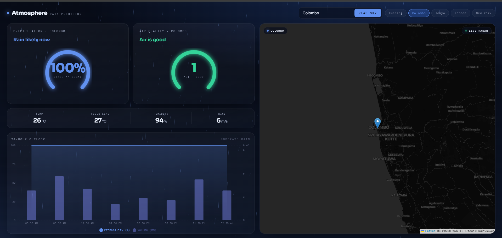

# 🌧️ Atmosphere · Rain Predictor

A live rainfall and atmosphere dashboard that reads the sky over any city — precipitation probability, air quality, current conditions, a 24-hour outlook, and an animated weather-radar map. Built as a vibe-coded project and progressively hardened into something shareable.

**Live demo:** https://rainfall-predictor-snowy.vercel.app



---

## Features

- **Reactive accent** — the entire interface shifts hue with rain probability, from warm amber (dry) to cool indigo (wet).
- **Probability dial** — a 270° gauge for the current precipitation chance, with a plain-language "next rain" summary (e.g. *Next rain ~11:00 AM · 100%*).
- **Air quality** — OpenWeather AQI rendered as a matching dial with semantic colouring.
- **Current conditions** — temperature, feels-like, humidity, and wind, shown as instrument-style readouts.
- **24-hour outlook** — a dual-axis chart of rain probability (%) against rain volume (mm).
- **Animated radar map** — looping RainViewer radar frames over a dark Leaflet basemap, with a live indicator.
- **Correct local time** — forecast times are shown in each city's own timezone, not the viewer's.
- **Responsive** — adapts from desktop down to tall, narrow phones (16:9 and 19.5:9).

---

## Tech stack

| Layer | Tools |
|-------|-------|
| Frontend | React, Vite, Recharts, React-Leaflet |
| Backend | FastAPI, httpx, Uvicorn |
| Data | OpenWeather (forecast + air quality), RainViewer (radar), CARTO/OSM (basemap) |
| Hosting | Vercel (frontend), Render (backend) |

---

## Project structure

```
rainfall-predictor/
├── backend/
│   ├── main.py            # FastAPI app: forecast + AQI endpoint, tile proxy, caching
│   ├── requirements.txt
│   └── .env               # WEATHER_API_KEY (not committed)
├── src/
│   ├── App.jsx            # Main UI
│   ├── index.css          # Design system + responsive layout
│   └── main.jsx
├── public/
├── index.html
└── package.json
```

---

## Running locally

You'll need **Python 3.11+**, **Node 18+**, and a free [OpenWeather API key](https://openweathermap.org/api).

### Backend

```bash
cd backend
python -m venv venv

# Windows
venv\Scripts\activate
# macOS / Linux
source venv/bin/activate

pip install -r requirements.txt
```

Create `backend/.env`:

```
WEATHER_API_KEY=your_openweather_key_here
```

Run it:

```bash
uvicorn main:app --reload
```

The API is now at `http://127.0.0.1:8000`. Try `http://127.0.0.1:8000/api/predict-rain/Kuching`.

### Frontend

From the project root:

```bash
npm install
npm run dev
```

The app opens at `http://localhost:5173` and talks to the local backend by default. To point it elsewhere, create a `.env` in the project root:

```
VITE_API_URL=http://127.0.0.1:8000
```

---

## Environment variables

| Variable | Where | Required | Purpose |
|----------|-------|----------|---------|
| `WEATHER_API_KEY` | backend | ✅ | OpenWeather API key |
| `VITE_API_URL` | frontend | on deploy | Backend base URL (defaults to localhost) |
| `FRONTEND_ORIGIN_REGEX` | backend | optional | Overrides the CORS allow-list regex |

---

## Deployment

The app is two pieces hosted separately, both deploying from this repo on every push.

**Backend → Render** (free web service)
- Root directory: `backend`
- Build: `pip install -r requirements.txt`
- Start: `uvicorn main:app --host 0.0.0.0 --port $PORT`
- Env var: `WEATHER_API_KEY`

**Frontend → Vercel**
- Framework preset: Vite
- Env var: `VITE_API_URL` set to the Render backend URL

> Note: Render's free tier spins down after inactivity, so the first request after a quiet period takes ~50 seconds to wake up. Subsequent requests are fast.

The backend's CORS allow-list is a regex matching this project's Vercel URLs (production and previews). Update `FRONTEND_ORIGIN_REGEX` on Render if you rename the project or add a custom domain.

---

## How it works

The frontend never touches the OpenWeather API directly — all weather and air-quality requests go through the FastAPI backend, which holds the API key and caches responses for 10 minutes. This keeps the key off the client and protects the request quota. The animated radar is the one exception: RainViewer is keyless, so the browser loads those tiles directly.

---

## Credits

- Weather & air quality: [OpenWeather](https://openweathermap.org/)
- Radar imagery: [RainViewer](https://www.rainviewer.com/)
- Basemap: [CARTO](https://carto.com/) & [OpenStreetMap](https://www.openstreetmap.org/) contributors
- Maps: [Leaflet](https://leafletjs.com/) · Charts: [Recharts](https://recharts.org/)

---

## License

MIT — free to use, modify, and share.
